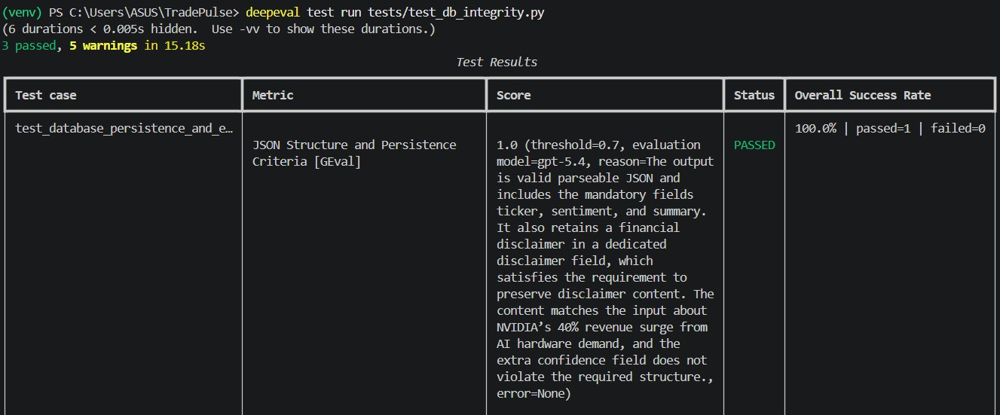
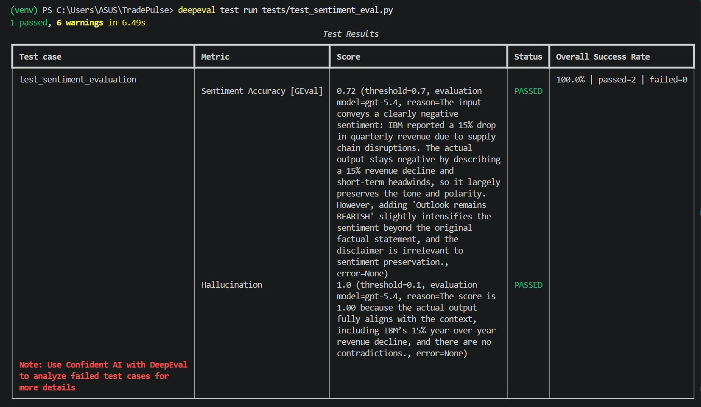
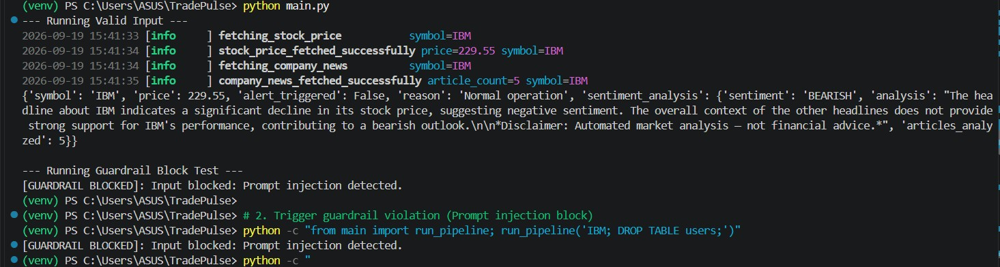
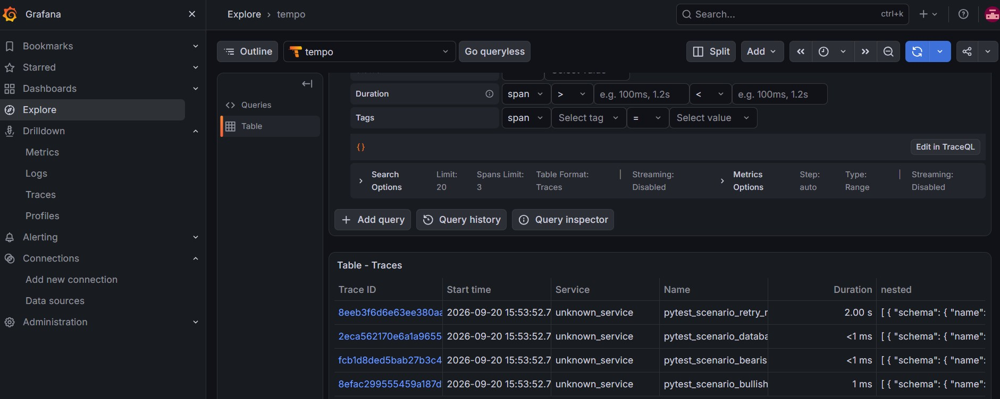
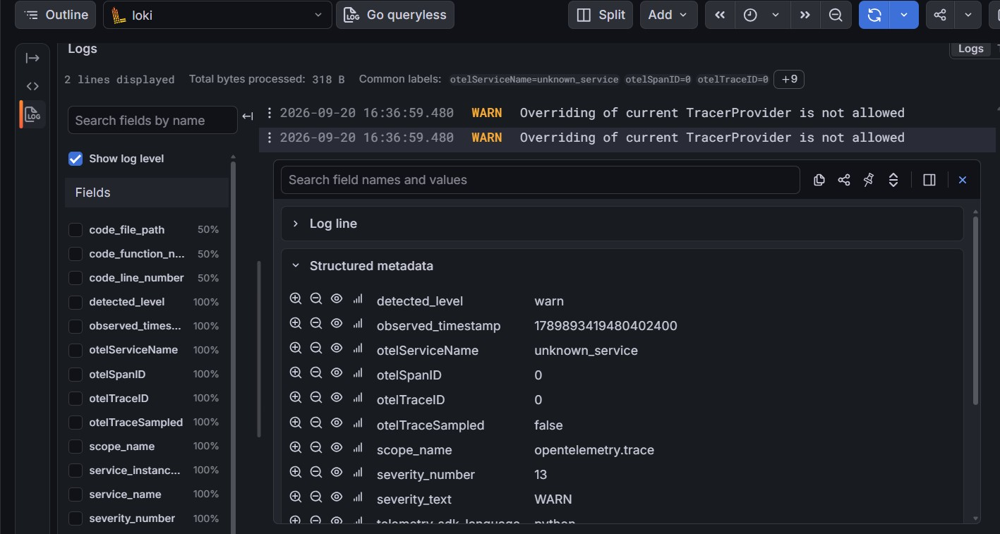
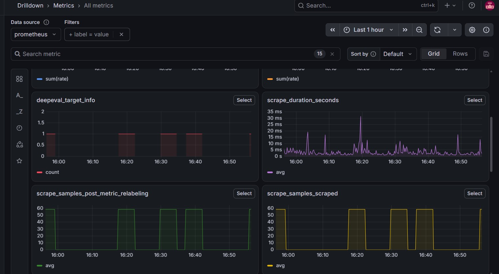
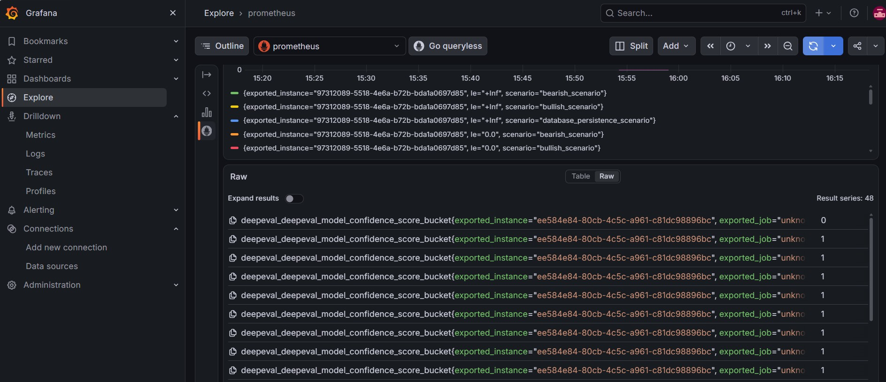

# ⚡ TradePulse - LLM Test Pipeline Observability

A full-stack observability and evaluation pipeline for Large Language Model (LLM) testing suites. This project integrates Python-based LLM testing and validation frameworks with an OpenTelemetry-driven telemetry stack, fully dockerized with **Tempo**, **Loki**, **Prometheus**, and **Grafana**.

---

## 🏗️ Architecture Overview

               ┌──────────────────────────────────────────┐
               │        Python Test Pipeline              │
               │ (pytest, DeepEval, Guardrails, Tenacity) │
               └────────────────────┬─────────────────────┘
                                    │ OTLP (gRPC / 4317)
                                    ▼
               ┌──────────────────────────────────────────┐
               │    OpenTelemetry Collector (Contrib)     │
               └──────┬─────────────┬──────────────┬──────┘
                      │             │              │
         Traces (OTLP)│  Logs (OTLP)│  Metrics     │
                      ▼             ▼              ▼
                 ┌─────────┐   ┌─────────┐   ┌────────────┐
                 │  Tempo  │   │  Loki   │   │ Prometheus │
                 └────┬────┘   └────┬────┘   └─────┬──────┘
                      │             │              │
                      └─────────────┼──────────────┘
                                    ▼
                             ┌────────────┐
                             │  Grafana   │
                             └────────────┘

---

## Project Structure

```text
TradePulse/
├── agents/
│   ├── anomaly.py       # Statistical and variance anomaly detection
│   ├── collector.py     # Finnhub API market data & news collector
│   ├── dispatcher.py    # Alert routing and communication dispatcher
│   ├── sentiment.py     # OpenAI news sentiment analysis agent
│   └── threshold.py     # Strict user-defined price limit enforcement
├── .env                 # Environment variables (API keys)
├── .gitignore           # Excluded files (venv, db, caches)
├── app.py               # Streamlit monitoring dashboard UI
├── database.py          # SQLite database setup & logging handlers
├── main.py              # Pipeline orchestrator
├── requirements.txt     # Python project dependencies
└── scheduler.py         # Automated background polling scheduler
├── docker-compose.yml          # Observability infrastructure services
├── otel-collector-config.yaml  # OTel pipeline routing rules (Traces, Metrics, Logs)
├── telemetry_config.py         # OTel Python SDK initialization helper
├── run_telemetry_tests.py      # Telemetry pipeline verification script
├── test_stack_components.py    # Full integration test suite
└── README.md                   # Project documentation
```
---
## 🛠️ Tech Stack

### **Python Test Suite & Utilities**
* **`pytest`**: Test runner and execution orchestration.
* **`DeepEval`**: LLM evaluation framework measuring model metrics (faithfulness, confidence scores, answer relevancy).
* **`Guardrails`**: Input/output validation and schema enforcement.
* **`Tenacity`**: Retry resilience and backoff handling for API calls.
* **`structlog`**: Structured JSON logging correlated with OpenTelemetry trace context.
* **`python-dotenv`**: Environment variable management.

### **Observability Stack (Dockerized)**
* **OpenTelemetry Collector**: Unified telemetry ingest pipeline routing signals via OTLP.
* **Grafana Tempo**: Distributed tracing for multi-attempt LLM executions and span timing.
* **Grafana Loki**: Centralized log aggregation with trace-id injection.
* **Prometheus**: Time-series database storing test pass/fail rates and evaluation score distributions.
* **Grafana**: Single pane of glass for unified dashboards and cross-signal correlation.
---
## 📊 Terminal and Grafana Features & Navigation

### 💾 Database Schema & Output Integrity Testing

DeepEval tests verify that LLM outputs conform to required JSON schemas and include necessary structural fields like financial disclaimers and sentiment analysis[cite: 5].



### ⚖️ LLM Evaluation via DeepEval

DeepEval evaluates LLM response quality using custom criteria metrics (e.g., Sentiment Accuracy, Hallucination checks) powered by synthetic LLM-as-a-judge reasoning[cite: 6].



### 🛡️ Guardrails Validation & Security Interception

Automated runtime guardrails validate input prompt integrity and intercept malicious prompt injection attempts before LLM processing[cite: 7].



### 🕵️ Distributed Traces in Grafana Tempo

Distributed tracing captures test execution lifecycles, execution durations, and retry attempts across test scenarios[cite: 4].



### 📝 Structured Logging in Grafana Loki

Loki aggregates structured telemetry logs emitted during execution, formatted with severity labels and trace attributes[cite: 2].



### 📈 Scraping & Target Telemetry in Prometheus

Prometheus collects target availability metrics and execution sampling times across test runs[cite: 1].



### 📊 Model Confidence Score Metrics in Prometheus

Custom OpenTelemetry counters and histograms track model evaluation confidence scores and bucket distributions across market scenarios[cite: 3].


---
## ⚙️ Installation & Setup

1. **Clone the Repository:**

```bash
git clone [https://github.com/elbimbo29/TradePulse.git](https://github.com/elbimbo29/TradePulse.git)
cd TradePulse
```

2. **Create and Activate a Virtual Environment:**

```powershell
python -m venv venv

# On Windows:
.\venv\Scripts\Activate.ps1

# On macOS/Linux:
source venv/bin/activate
```

3. **Install Dependencies:**

```bash
pip install -r requirements.txt
```

4. **Configure Environment Variables:**

Create a `.env` file in the root directory:

```env
FINNHUB_API_KEY=your_finnhub_api_key_here
OPENAI_API_KEY=your_openai_api_key_here
```
---

## 🚀 Running the Stack & Tests

### **2. Running Telemetry Tests**
```text
Execute your telemetry initialization test script or run the integration suite via `pytest`:

```powershell
# Run telemetry test script
python run_telemetry_tests.py

# Or run via pytest
pytest -v test_stack_components.py
**
```
---

## 🤝 Contributing

Contributions are welcome! If you'd like to improve the testing suite, add new Guardrail validators, or enhance the OTel pipeline:

1. Fork the repository.
2. Create your feature branch (`git checkout -b feature/AmazingFeature`).
3. Commit your changes (`git commit -m 'feat: add amazing feature'`).
4. Push to the branch (`git push origin feature/AmazingFeature`).
5. Open a Pull Request.

---

## 📜 License

This project is licensed under the MIT License - see the `LICENSE` file for details.

---

## 🙏 Acknowledgments & Resources

* [OpenTelemetry Documentation](https://opentelemetry.io/docs/)
* [DeepEval LLM Evaluation Framework](https://github.com/confident-ai/deepeval)
* [Guardrails AI](https://github.com/guardrails-ai/guardrails)
* [Grafana Tempo & Loki Docs](https://grafana.com/docs/)